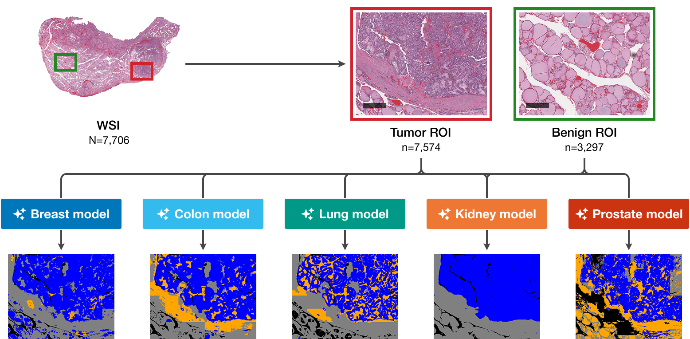

<div align="center">

# Cross-Cancer Histopathology Segmentation Evaluation

[](https://creativecommons.org/licenses/by-nc/4.0/)
[](#citation)
[](https://doi.org/10.5281/zenodo.18520078)

</div>

This repository contains the code for the paper:

> **Comprehensive evaluation of cross cancer generalization in histopathology segmentation models across 21 tumor types**<br>
> Tillmann Bedau, Christian Harder, Abdulkader Al-Shughri, Yuan Wang, Alexey Pryalukhin, Marie-Lisa Eich, Su Ir Lyu, Reinhard Büttner, Alexander Quaas, Yuri Tolkach<br>
> *Currently in revision.*

<p align="center">
  
</p>

## Pipeline overview

```
Raw TCGA Whole-Slide Images (N=7,706)
        │
        v
  [qupath-annotation]  ─  Annotate and export tumor/benign ROIs using QuPath
        │
        v
  [segmentation-pipeline]  ─  Run 5 organ-specific models and compute Dice coefficients
        │
        v
  [scoring-app]  ─  Score model outputs side-by-side via a web interface (0–10 scale)
        │
        v
  [scoring-analysis]  ─  Statistical analysis and publication figures (R/Quarto)
```

## Repository structure

| Directory | Description |
|-----------|-------------|
| [`qupath-annotation/`](qupath-annotation/) | QuPath (v0.5.0) Groovy scripts for creating rectangular annotations and exporting tissue regions and ground-truth class maps |
| [`segmentation-pipeline/`](segmentation-pipeline/) | Python patch-based semantic segmentation using [segmentation_models_pytorch](https://github.com/qubvel-org/segmentation_models.pytorch), plus Dice coefficient evaluation against ground truth |
| [`scoring-app/`](scoring-app/) | FastAPI web application for manual side-by-side scoring of five model outputs with zoomable viewers |
| [`scoring-analysis/`](scoring-analysis/) | R/Quarto notebooks generating all publication figures and statistical analyses |

Each directory contains its own README with setup instructions and usage details.

## Data

Research data associated with this study is hosted on Zenodo:

| Dataset | Description | Link |
|---------|-------------|------|
| Evaluation data | Scoring results, Dice coefficients, clinical metadata | [](https://doi.org/10.5281/zenodo.18518811) |
| Tissue ROIs | Exported tumor and benign ROIs from 21 TCGA cohorts | DOI pending |
| Segmentation masks | Model prediction masks for all ROIs (9-month embargo) | DOI pending |

The evaluation data (scoring results, Dice coefficients, clinical metadata) is required to run the analysis notebooks. Download it with:

```bash
./download_data.sh            # evaluation data only (default)
./download_data.sh --rois     # tissue ROIs
./download_data.sh --masks    # segmentation masks
./download_data.sh --all      # everything
```

This creates a `data/` directory at the repository root containing:

| File / Directory | Description |
|------------------|-------------|
| `scoring_data.csv` | Segmentation quality scores from the primary rater |
| `scoring_data_second_rater.csv` | Scores from the second rater (inter-rater analysis) |
| `pathologist_inference_ratings.csv` | Manual inference quality ratings per model and cohort |
| `clinical-data/` | TCGA clinical metadata (22 tumor types, from GDC) |
| `dice-results/` | Per-ROI Dice coefficients for each cohort–model combination |

## Requirements

- **qupath-annotation**: [QuPath](https://qupath.github.io/) v0.5.0+
- **segmentation-pipeline** and **scoring-app**: [uv](https://docs.astral.sh/uv/) (manages Python and all dependencies automatically)
- **scoring-app** can alternatively be run with Docker
- **scoring-analysis**: R 4.4+, [RStudio](https://posit.co/products/open-source/rstudio/) (renv manages R dependencies)

Install uv if you don't have it yet:

```bash
curl -LsSf https://astral.sh/uv/install.sh | sh
```

Then run any Python component with `uv run`, e.g.:

```bash
cd segmentation-pipeline
uv run segment.py --help
```

uv will automatically download the correct Python version and install all dependencies on first run.

## Citation

<!-- TODO: Add citation info once the manuscript is published. -->

## License

This project is licensed under the [Creative Commons Attribution-NonCommercial 4.0 International License](LICENSE).
